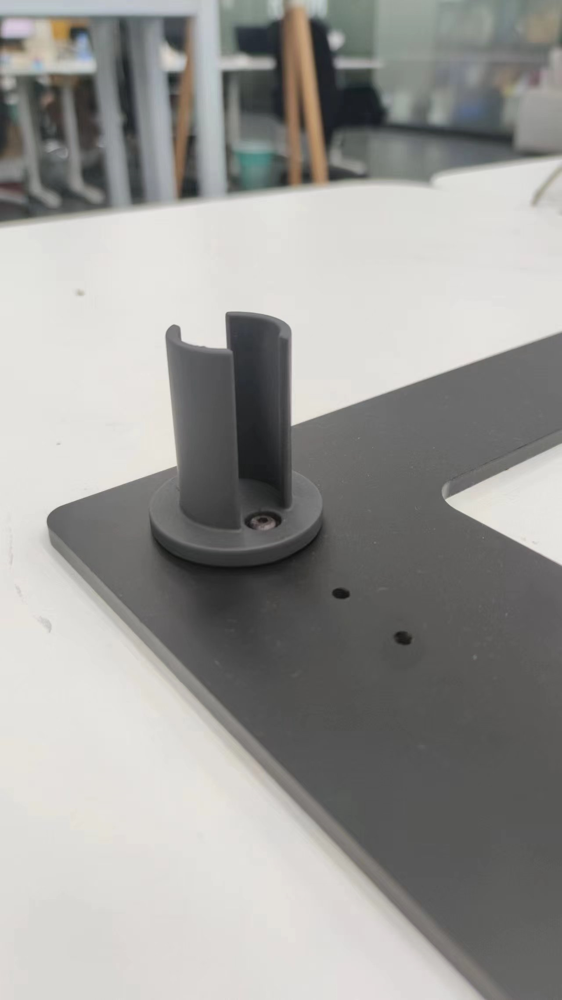
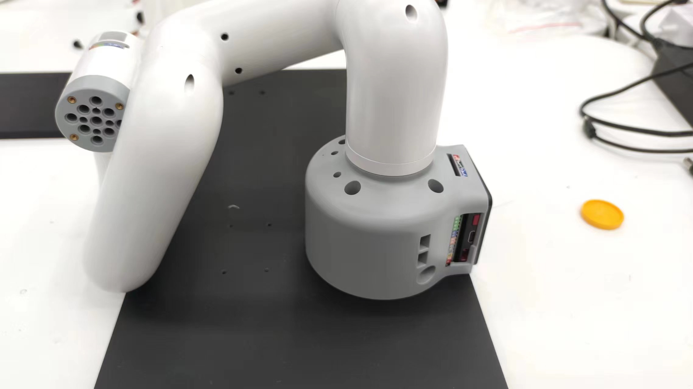
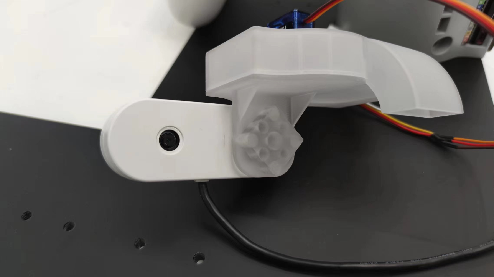
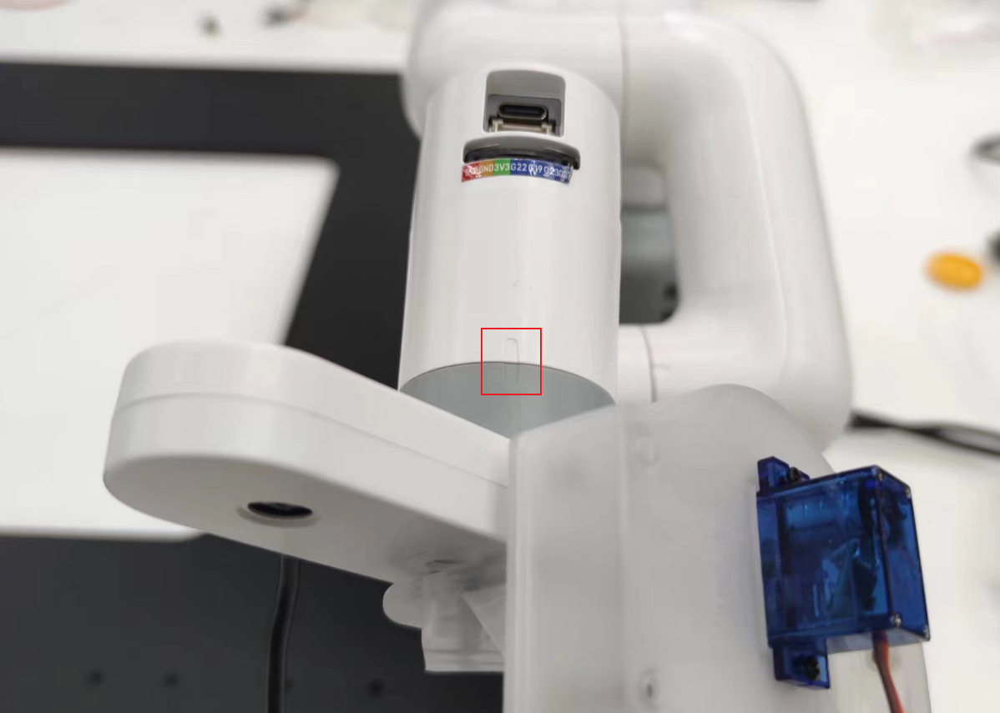
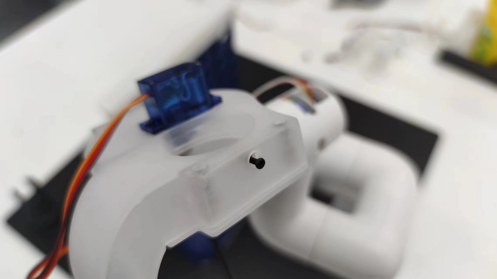
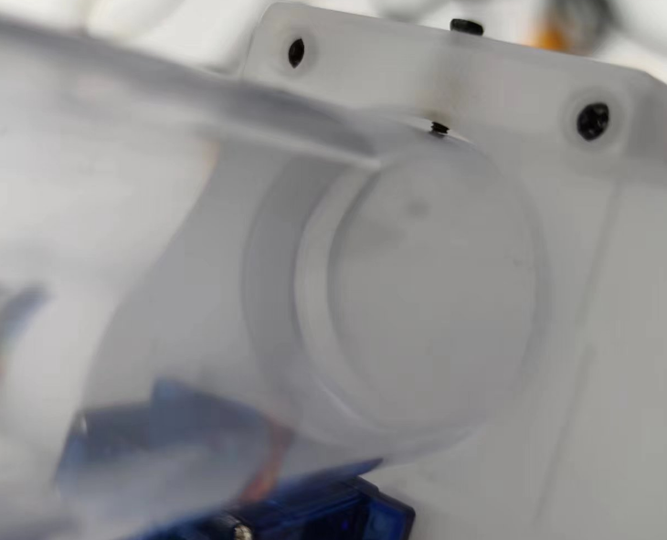
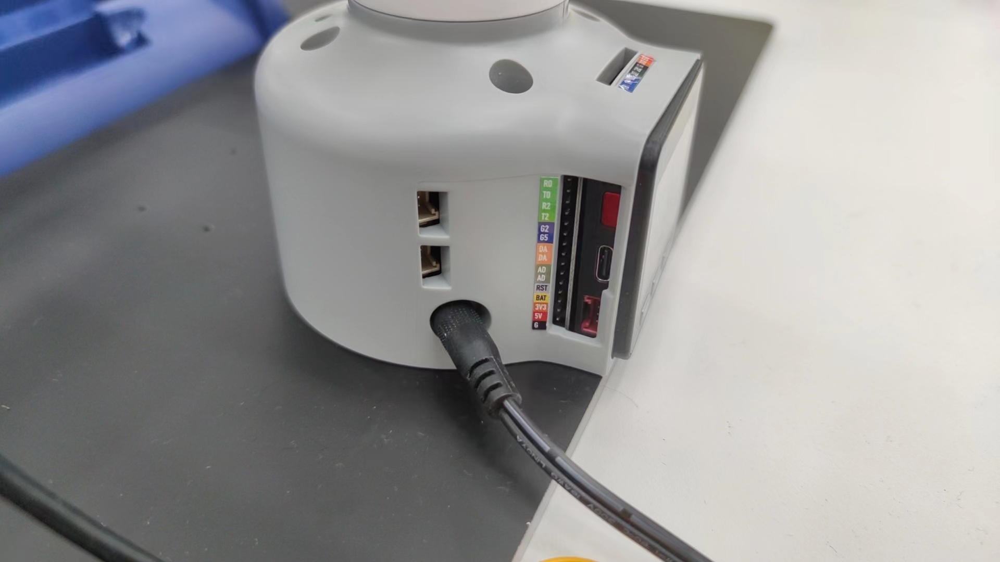
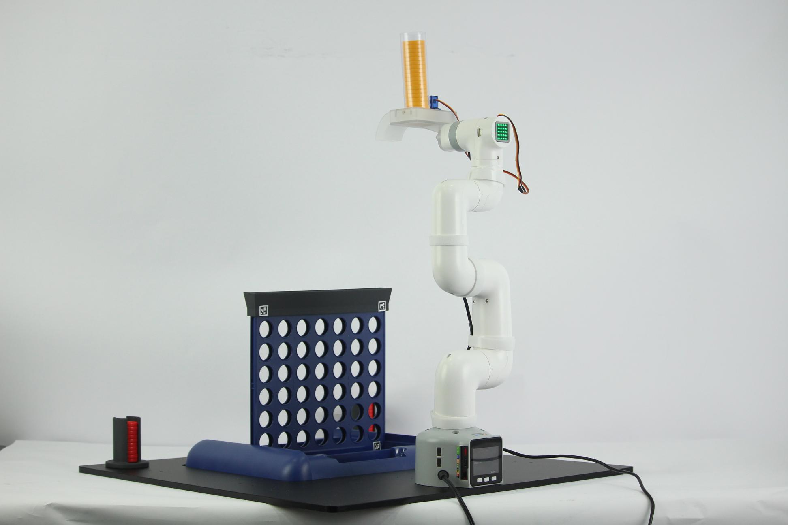
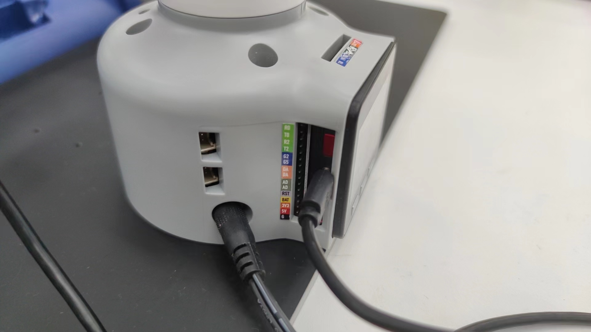

# 硬件安装

## 底盘棋子架安装

取出棋盘底盘和棋子架

在对应孔位拧上螺丝

## 棋盘安装

在棋盘下侧的两个角落，贴上二维码

在棋盘帽的两个角落，贴上二维码

有二维码的一面，面向机械臂放置到棋盘底座上

## 机械臂安装

先使用螺丝固定机械臂到底盘上

取出相机模组和下棋模组，使用乐高件连接在一起

将连接好的相机模组和下棋模组安装到机械臂上
**注意：区分安装方向**

以机械臂的旋转标志为参照物，如图所示安装

将下棋模组的线，连接到机械臂上

略微拧松下棋模组侧面的螺丝

插入棋桶以后拧紧

将机械臂扶正，接入电源；（机械臂上电以后关节会锁定）

至此，机械臂硬件部分安装完成

## 通信连接

### M5版本

机械臂本体和相机需要连接到PC

机械臂的连接端口

### Pi版本

Pi版本机械臂无需连接自身，相机模块需要连接到机械臂上的USB端口
