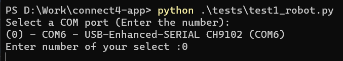
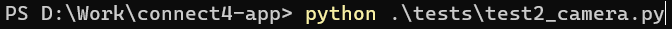
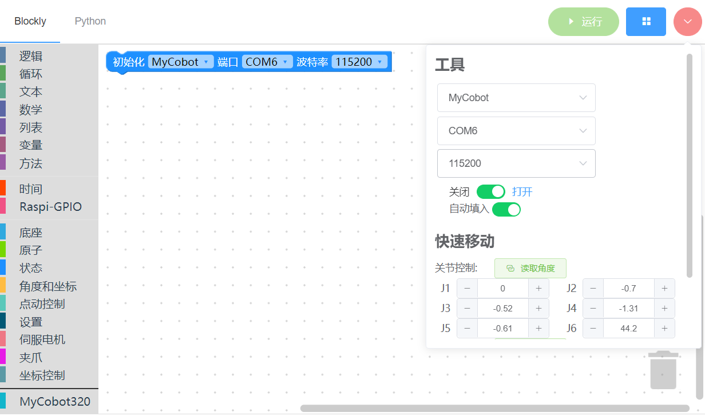
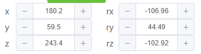
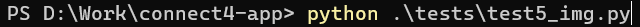
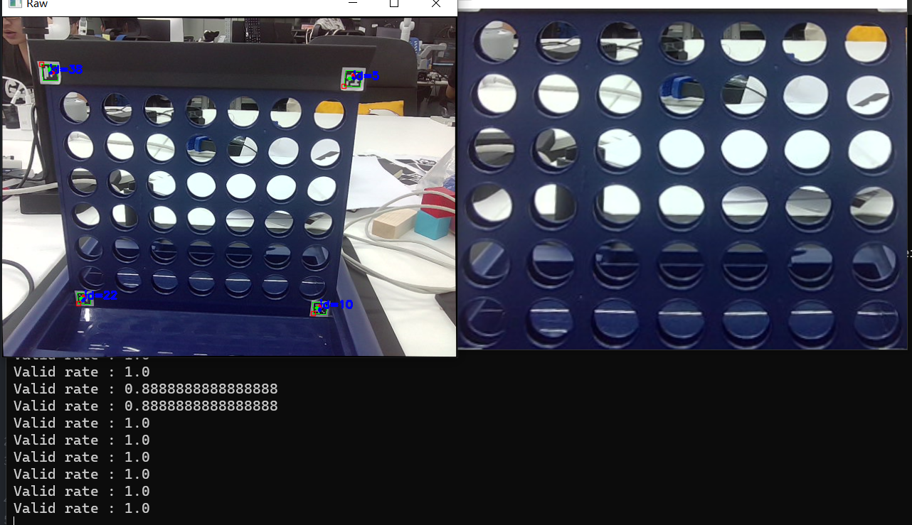

import ReactPlayer from "react-player"

# 单元测试

**注意： 所有的测试都必须从项目根目录，通过`python tests/testX.py`启动**

## 机器人运动测试

进入根目录，在此处打开终端并输入`python .\tests\test1_robot.py`

根据提示输入连接机器人的串口(输入序号即可，例如上面的输入 0, 请根据实际情况选择串口)

观察机器人的运动，如果 6 个轴都有正负角度变化，说明机械臂的通信正常；如果机器人没有动作，则说明可能通信或者固件存在问题。

## 相机测试

进入根目录，在此处打开终端并输入`python .\tests\test2_camera.py`

**部分系统上相机打开速度可能有些缓慢,请耐心等待**

如果相机没有图像，可以尝试修改`test2_camera.py`中的 cam_index, 可以尝试`0,1,2,3`等数字
观察相机图像是否清晰，如果图像模糊，可能需要考虑擦拭镜片。

**测试完毕后在图像显示的框内按 Q 键即可退出**

## 下棋装置测试

下棋装置是一个固定在机械臂末端的特殊结构，测试这个项目需要先安装好下棋装置是否能够正常运行
**注意：运行前下棋装置的需要装入足量的棋子（>5 个）**

<ReactPlayer playing controls url="/docs/connect-4/videos/test3.mp4" />

进入根目录，在此处打开终端并输入`python .\tests\test3_trigger.py`

观察下棋装置是否能将棋子推出装置

## 机器人运动点测试

这个测试需要完全安装好棋盘和机械臂，机械臂会按顺序尝试访问所有点位，你需要观察机械臂抵达的点位的精准度

进入根目录，在此处打开终端并输入`python .\tests\test4_drop_point.py`

### 如何根据结果调整点位

下棋的点位在机械臂系统中是固定的，由于机械原因，每台机械臂可能都会存在一些误差，因此需要手动校准。下面我来演示一下如何修改校准点位。
首先打开[myBlockly](https://www.elephantrobotics.com/download/)软件

然后打开您的代码编辑器，找到`core\ArmInterface.py`中的`self.chees_table`

假设您要修改第一个下棋点，也就是`self.chess_table[0]`,先使用 myBlocky 将机械臂运动到这个位置

可以看到,机械臂的位置距离目标有些靠前了，需要调整一下
机械臂的坐标系定义为,机械臂的前方是 X 轴正方向,左边是 Y 轴正方向,上面是 Z 轴正方形
因此根据情况，我们需要降低 X 坐标

现在，读取一下**角度值**，然后将这个值写回到`core\ArmInterface.py`中

`注意: chess_table的内容是角度值,不是坐标值`

## 图像采集点测试

在这个测试中，机械臂会自动移动到观察姿态，如果二维码和机械臂的相对位置正确，你会看到另一个仅有棋盘的窗口

进入根目录，在此处打开终端并输入`python .\tests\test5_img.py`

如果相机没有图像，可以尝试修改`test5_img.py`中的 cam_index, 可以尝试`0,1,2,3`等数字

这个测试还会在命令行输出`valid rate`, 这表示识别率。这个数字越接近 1 越好, 1 代表每一帧都能识别到 4 个二维码, 一般来说要保证程序运行正常, 至少需要 0.8 以上的识别率
