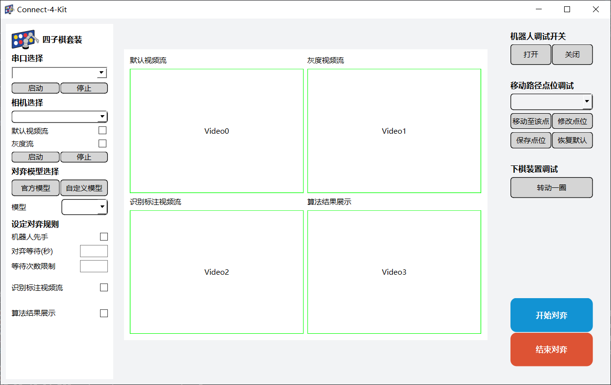

# 运行程序

## 运行前须知

1. 本产品采用纯光学识别，请保证机器人透过棋盘孔的可视范围内不要出现红色或者黄色的物品，（例如尽量不要穿着红色或者黄色的衣服；棋子不要堆在桌子上，要放在棋桶内； 尽量使胳膊放在识别范围外等）
2. 光照条件可能会对二维码的识别产生影响，运行前请务必先运行`图像采集点测试`，调试到可以稳定识别二维码后再开始。
3. 先手的一方必须执红色棋子，后手的一方必须执黄色棋子。运行前需要给机械臂加满对应的棋子。

## Windows系统

在工程目录下打开任意终端程序，输入以下命令

> Windows系统: 可以在文件夹空白处，按住Shift+右键，选择在此处打开Powershell来在该位置快速打开终端

```bash
python app.py
```

1. 首先选择串口，选择完毕以后点击启动，等待机械臂连接
2. 然后选择相机，相机一般是0或者1。然后勾选**默认视频流、灰度流、识别标注视频流**，最后点击启动，耐心等待相机启动，这个过程可能需要十几秒。
3. 点击开始对弈，即可开始游戏
4. 如果产生了胜利者，机械臂会回到原点。并通过GUI提示玩家游戏结束。

> 需要注意:默认情况下为机器人后手，后手状态下棋桶中应该装入黄色棋子。玩家执红棋。如果勾选了机器人先手，则棋桶中应该放入红色棋子，玩家执黄色棋子



## Linux系统（PI版本）

在工程目录下打开任意终端程序，输入以下命令

```bash
python3.11 app.py
```
