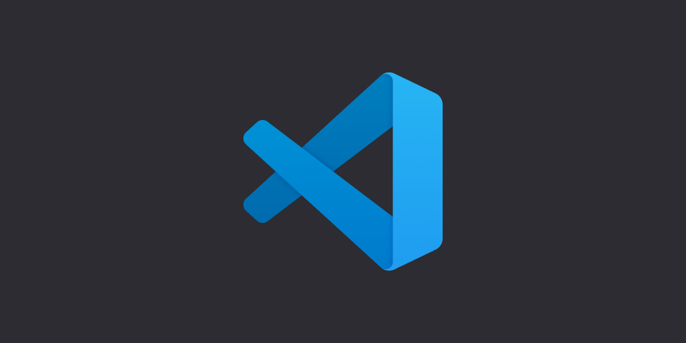

# 如何自定义

## 开发环境搭建

如果需要对代码进行自定义，你需要一个Python开发环境，我们推荐使用Visual Studio Code作为开发使用的编辑器。

在开始搭建环境之前，首先需要确保你已经安装了Python，如果你还没有安装，请看[软件环境配置](/cp2-tutorial/sec1-software.md)

前往[VS Code官网](https://code.visualstudio.com/)下载对应的系统的安装包并安装

然后根据[VS Code官方Python环境配置教程](https://code.visualstudio.com/docs/python/python-tutorial)配置相应环境

## 尝试打开项目并运行

打开VS Code，点击`文件`-`打开文件夹`, 选择Connect-4-Kit的代码目录并确定。

尝试点击`运行`-`以非调试模式运行`运行程序

可以自行尝试修改代码再运行，看看发生了什么变化
