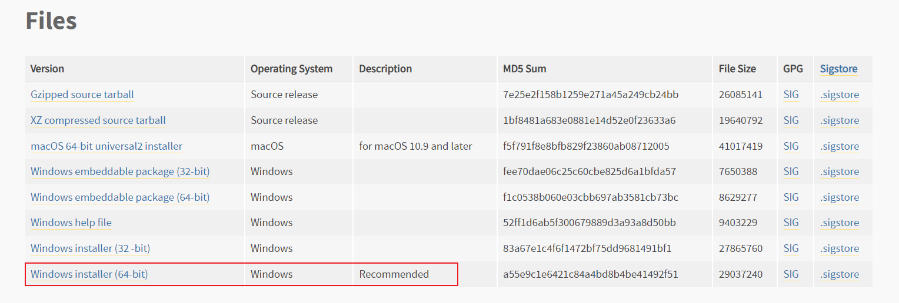

# 软件环境准备

## Python安装

Python是本项目的主开发语言，需要使用3.10版本以上，下面介绍在各个平台如何安装配置环境

### Windows

访问[Python3.10官方下载页面](https://www.python.org/downloads/release/python-31011/)，选择MSI版本下载并安装即可



注意：安装过程中记得勾选自动添加到环境变量

安装完毕后，`Win+R`打开运行，输入`CMD`，在弹出的CMD窗口中输入`python`以检查是否成功


### Ubuntu

Python需要使用3.10版本以上，这里介绍一下如何在Ubuntu上安装别的版本

首先添加自定义仓库，请勿直接安装

```bash
sudo apt install software-properties-common
sudo add-apt-repository ppa:deadsnakes/ppa
sudo apt update
```

然后使用apt安装python3.10版本和相关工具

```bash
sudo apt-get install python3.10
sudo apt-get install python3.10-distutils
```

检验是否安装成功

```bash
python3.10 --version
# python 3.10.12
```

## Git

Git是用来下载和管理代码的工具，在本项目中用来拉取项目代码

Git的下载安装请参考[官方教程](https://git-scm.com/book/zh/v2/%E8%B5%B7%E6%AD%A5-%E5%AE%89%E8%A3%85-Git)

## 配置项目环境

按顺序执行以下命令

```bash
git clone https://github.com/elephantrobotics/Connect-4-Kit.git
cd Connect-4-Kit
pip install -r requirements.txt
```

Done.
