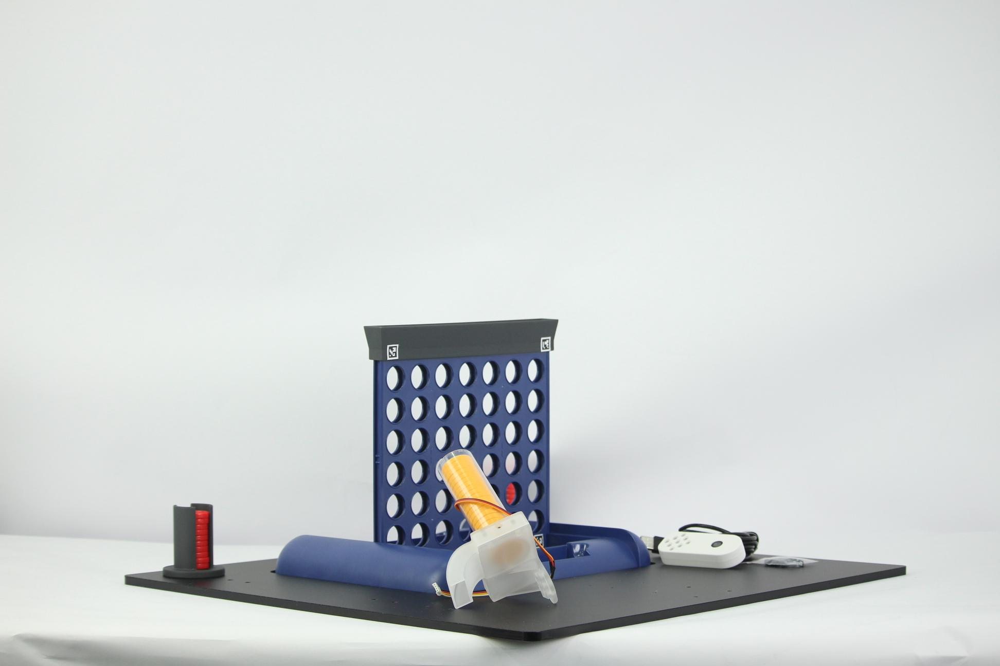
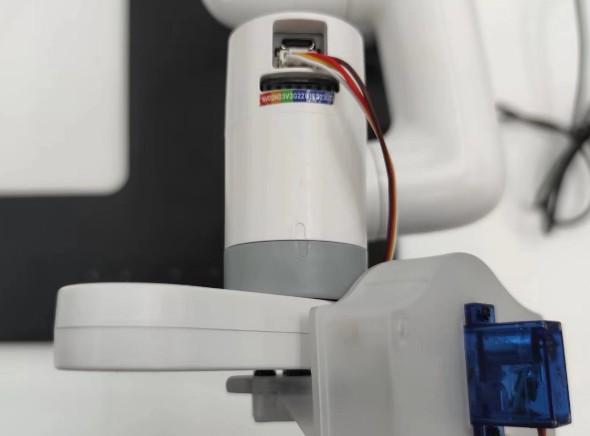

# Hardware Installation

## Chassis and Piece Holder Installation

Take out the chessboard chassis and the piece holder.

Screw the screws into the corresponding holes.

## Chessboard Installation

Attach QR codes to the two corners on the underside of the chessboard.

Attach QR codes to the two corners of the chessboard cap.

Place the side with QR codes facing the robotic arm on the chessboard base.

## Robotic Arm Installation

Secure the robotic arm to the chassis using screws.

Take out the camera module and the chess-playing module, and connect them together using LEGO pieces.

Install the connected camera module and chess-playing module onto the robotic arm.
**Note: Pay attention to the installation orientation.**

Use the rotation indicator on the robotic arm as a reference point for installation, as shown in the diagram.

Connect the wires from the chess-playing module to the robotic arm.

Slightly loosen the screws on the side of the chess-playing module.

Insert the chess bucket and tighten it.

Align the robotic arm, power it on, and the joints will lock.

At this point, the hardware installation of the robotic arm is complete.

## Communication Connection

### M5 Version

The robotic arm body and the camera need to be connected to the PC.

Connection port on the robotic arm:

Also make sure that the screen on robot arm's base displaying "Atom : OK"

### Pi Version

For the Pi version of the robotic arm, there is no need to connect to itself. The camera module needs to be connected to the USB port on the robotic arm.
