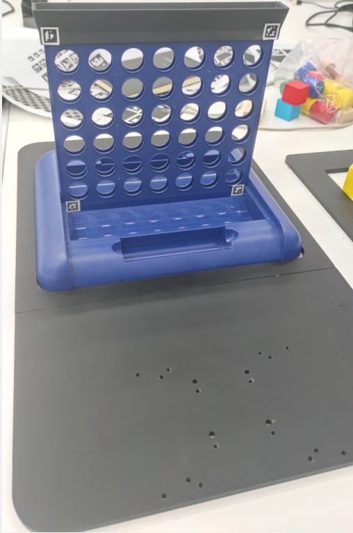
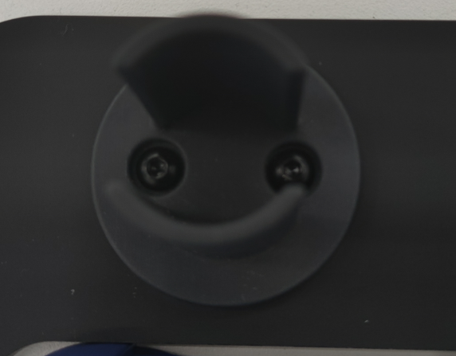
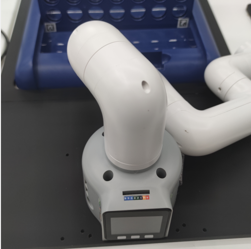
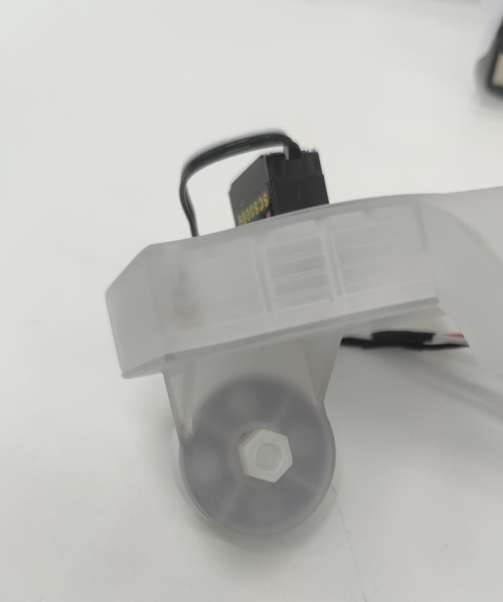

# Hardware Installation

## Chessboard Installation

Attach QR codes to the bottom corners of the chessboard.

Attach QR codes to the top corners of the chessboard cap.

Place the side of the chessboard with QR codes facing the robotic arm on the chessboard base.

Fasten the screws on the chess piece rack.

## Robotic Arm Installation

Secure the robotic arm to the base using screws.

Retrieve the chess-playing device and connectors; **note the small fixed structure on the device here**.

Assemble them together using screws.

Connect the LEGO parts and the camera together.

Install the assembled camera module and chess-playing module on the robotic arm.
**Note: Pay attention to the installation direction as shown in the reference to the robotic arm's rotation marker**.

Connect the cable from the chess-playing module to the robotic arm.

Slightly loosen the screws on the side of the chess-playing module.

Insert the chess bucket and tighten it.

Position the robotic arm correctly, connect the power supply; (the joints of the robotic arm will lock after powering up).

At this point, the hardware installation of the robotic arm is complete.

## Communication Connection

### M5 Version

The main body of the robotic arm and the camera need to be connected to the PC, with the camera connected to the computer via USB and the robotic arm requiring a Type-C interface cable connection to the computer.

The connection port of the robotic arm:

Ensure that "Atom: OK" is displayed on the robotic arm's screen.

### Pi Version

For the Pi version of the robotic arm, there is no need to connect it to itself. The camera module needs to be connected to the USB port on the robotic arm.