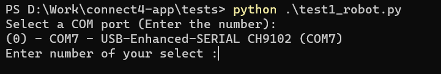
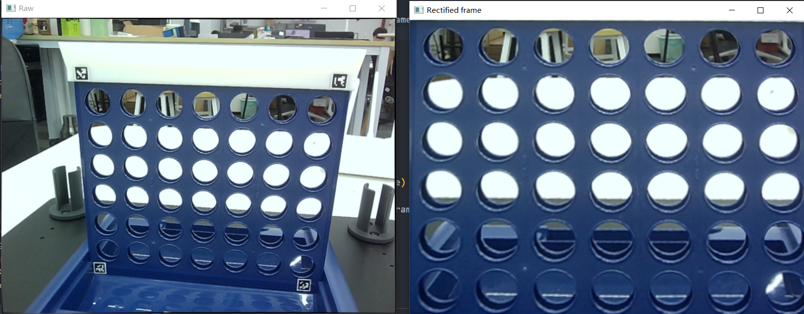

import ReactPlayer from "react-player"

# Unit Testing

## Robot Testing

Navigate to the tests directory and open the terminal here. Enter python test1_robot.py in the terminal.

Follow the prompt to input the serial port for connecting to the robot (enter the corresponding index, e.g., 0 in the above example).

Observe the movement of the robot. If all 6 axes show changes, it indicates that the communication with the robotic arm is functioning properly. If the robot does not move, there may be communication or firmware issues.

## Camera Testing

Navigate to the `tests` directory and open the terminal here. Enter `python test2_camera.py` in the terminal.

Observe if the camera image is clear. If the image is blurry, consider cleaning the lens.

## Chess Trigger Testing

The chess trigger is a special structure fixed to the end of the robotic arm. To test this project, make sure the chess trigger is installed properly and can function correctly.
**Note: Before running the test, make sure the chess trigger is loaded with enough chess pieces (>5).**

<ReactPlayer playing controls url="/docs/connect-4/videos/test3.mp4" />

Navigate to the `tests` directory and open the terminal here. Enter `python test3_trigger.py` in the terminal.

Observe if the chess trigger can push the chess pieces out.

## Robot Movement Point Testing

This test requires the chessboard and robotic arm to be fully installed. The robotic arm will attempt to visit all the points in order. You need to observe the accuracy of the robotic arm reaching each point.

Navigate to the `tests` directory and open the terminal here. Enter `python test4_drop_point.py` in the terminal.

## Image Capture Point Testing

In this test, the robotic arm will automatically move to the observation position. If the QR codes and the relative position of the robotic arm are correct, you will see another window with only the chessboard.

Navigate to the `tests` directory and open the terminal here. Enter `python test5_img.py` in the terminal.
