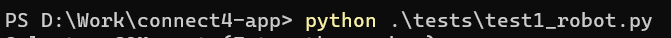
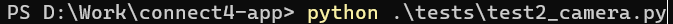
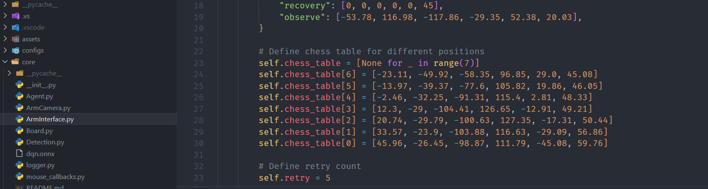
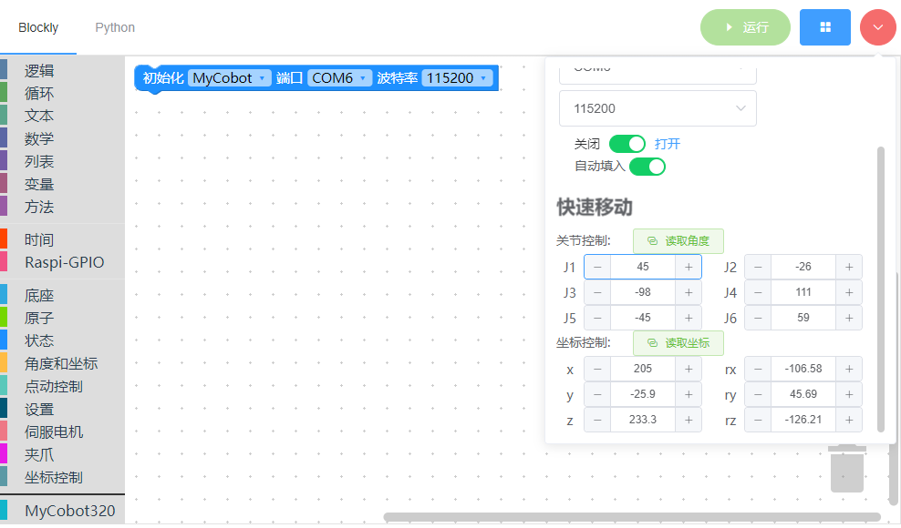
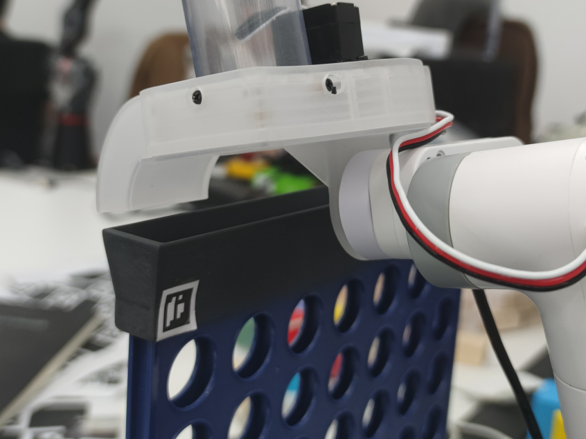
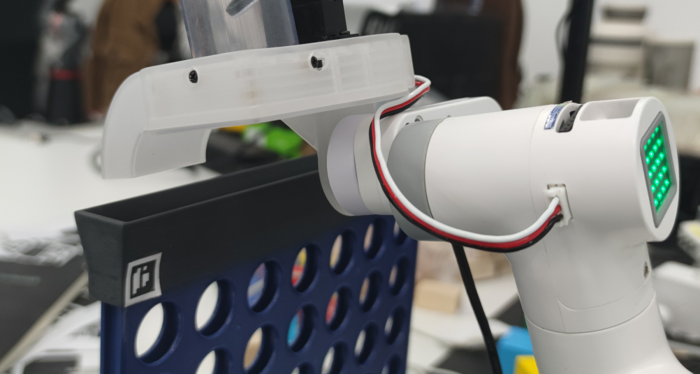

import ReactPlayer from "react-player"

# Unit Testing

**Notice: All tests must be executed from the project's root directory using `python tests/testX.py` as the command to start them.**

## Robot Testing

Open the terminal in root directory. Enter `python .\tests\test1_robot.py` in the terminal.

Follow the prompt to input the serial port for connecting to the robot (enter the corresponding index, e.g., 0 in the above example).

Observe the movement of the robot. If all 6 axes show changes, it indicates that the communication with the robotic arm is functioning properly. If the robot does not move, there may be communication or firmware issues.

## Camera Testing

Open the terminal in root directory. Enter `python .\tests\test2_camera.py` in the terminal.

**Camera initialization could be slow on some system, don't panic if it looks stuck**

If the camera has no image, you can try modifying the `cam_index` in `test2_camera.py`. You can attempt numbers like `0, 1, 2, 3`, etc.

**You can press Q to quit when you're done testing.**

Observe if the camera image is clear. If the image is blurry, consider cleaning the lens.

## Chess Trigger Testing

The chess trigger is a special structure fixed to the end of the robotic arm. To test this project, make sure the chess trigger is installed properly and can function correctly.
**Note: Before running the test, make sure the chess trigger is loaded with enough chess pieces (>5).**

        <ReactPlayer playing controls url="/docs/connect-4/videos/test3.mp4" />

Open the terminal in root directory. Enter `python .\tests\test3_tigger.py` in the terminal.

Observe if the chess trigger can push the chess pieces out.

## Robot Movement Point Testing

This test requires the chessboard and robotic arm to be fully installed. The robotic arm will attempt to visit all the points in order. You need to observe the accuracy of the robotic arm reaching each point.

Open the terminal in root directory. Enter `python .\tests\test4_drop_point.py` in the terminal.

If it doesn't meet your expectations, you can manually modify the values in `self.chess_table` within `core\ArmInterface.py`. You can use software like [myBlockly](https://www.elephantrobotics.com/download/) to assist with the operation.

### How to Adjust Positions Based on Results

In a robotic arm system for playing chess, the positions of the chess pieces are fixed. Due to mechanical reasons, there may be some errors in each robotic arm, so manual calibration is required. Below, I will demonstrate how to modify calibration positions.

First, open the [myBlockly](https://www.elephantrobotics.com/download/) software.

Then, open your code editor and locate `self.chess_table` in `core\ArmInterface.py`.

Let's assume you want to modify the position of the first chess piece, which is `self.chess_table[0]`. Use myBlockly to move the robotic arm to this position first.

You can see that the robotic arm's position is a bit too forward from the target, so it needs adjustment. The robotic arm's coordinate system is defined such that its front is the positive X-axis direction, left is the positive Y-axis direction, and up is the positive Z-axis direction. Therefore, depending on the situation, we need to decrease the X-coordinate.

Now, read the **angle values** and write this value back into `core\ArmInterface.py`.

Note: The contents of `chess_table` are angle values, not coordinate values.

## Image Capture Point Testing

In this test, the robotic arm will automatically move to the observation position. If the QR codes and the relative position of the robotic arm are correct, you will see another window with only the chessboard.

Navigate to the `tests` directory and open the terminal here. Enter `python .\tests\test5_detect.py` in the terminal.

If the camera has no image, you can try modifying the `cam_index` in `test5_detect.py`. You can attempt numbers like `0, 1, 2, 3`, etc.

This test will also output the "valid rate" in the command line, which represents the recognition rate. The closer this number is to 1, the better. A value of 1 indicates that all four Aruco codes are recognized in every frame. Generally, to ensure the program is running properly, a recognition rate of at least 0.8 or above is required.
