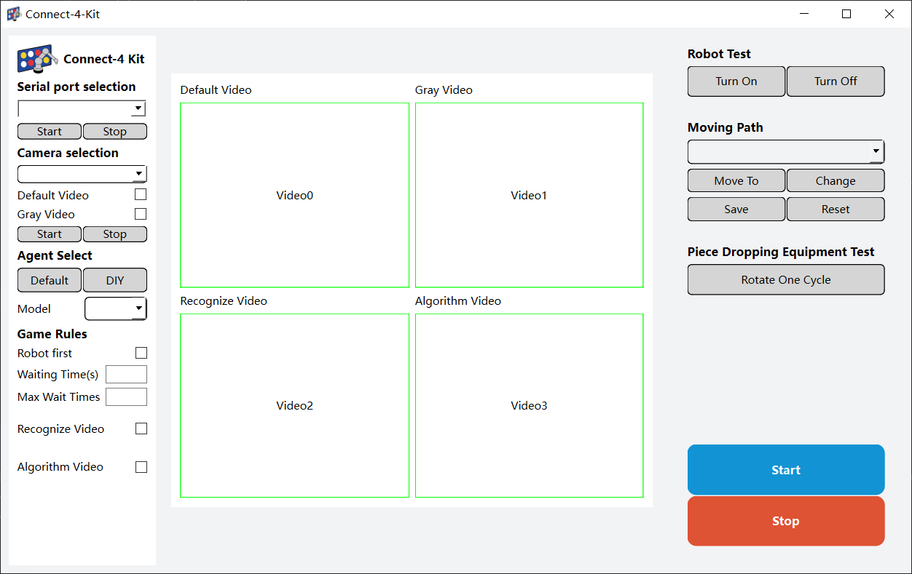

# Running the Program

## Before you run

1. This product relies on pure optical recognition. Please ensure that within the visible range through the holes of the chessboard, there are no red or yellow objects present. (For example, avoid wearing red or yellow clothes; do not stack game pieces on the table, place them inside the piece container; try to keep your arms outside the recognition area, etc.)

2. Lighting conditions can impact the recognition of QR codes. Before running, be sure to perform the "Image Collection Point Test" first. Fine-tune the system until QR codes can be consistently recognized under stable conditions.

3. The player going first must use red game pieces, while the player going second must use yellow game pieces. Before running, make sure to fill the robotic arm with the corresponding game pieces.

## Windows

Open any terminal program in the project directory and enter the following command:

> You can quickly open the terminal at the current location by holding Shift and right-clicking on a blank area in the folder, then selecting "Open PowerShell here."

```bash
python app.py
```

1. First, select the serial port, and after making your selection, click "Start" and wait for the robotic arm to establish a connection.
2. Next, choose the camera; typically, it's either 0 or 1. Then, check the boxes for **Default Video Stream**, **Grayscale Stream**, and **Recognition Annotated Video Stream**. Finally, click "Start" and patiently wait for the camera to initiate. This process might take around ten seconds.
3. Click "Start Game" to begin playing.
4. If a winner emerges, the robotic arm will return to its original position. The player will be notified of the game's conclusion through the GUI.

> Note: By default, the robot plays as the second player, which means the yellow pieces should be placed in the chess bucket. The player takes the red pieces. If you choose the robot to play first, then red pieces should be placed in the chess bucket, and the player will use the yellow pieces.



## Linux(Pi version)

Open any terminal program in the project directory and enter the following command:

```bash
python3.11 app.py
```
