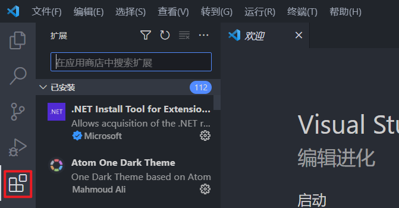

# 如何搭建Python开发环境

如果需要对代码进行自定义，你需要一个Python开发环境，本节介绍一下基于流行的Visual Studio Code的开发环境搭建。

在开始搭建环境之前，首先需要确保你已经安装了Python，如果你还没有安装，请看[软件环境配置](/cp2-tutorial/sec1-software.md)

先前往[VS Code官网](https://code.visualstudio.com/)下载对应的系统的安装包并安装

安装完毕以后，打开VS Code

点击左侧的`扩展`按钮

